# ⚛️ React Performance Profiling Report

This report summarizes performance profiling results using **React DevTools Profiler**. The goal was to analyze and optimize key user interactions in a React-based application. Metrics such as commit duration and render duration were recorded before and after optimization. Screenshots include flame graphs and ranked charts for visual comparison.

●	Tested interactions:   
- Sorting a column  
- Searching for a country  
- Selecting a year  
- Adding/removing columns  

---

## 🔁 Sorting a Column

**Before Optimization**
- Commit Duration: `1.5s`
- Render Duration: `97.5ms`
- Interactions: Not recorded (Profiler did not capture interactions)  

*Flame Graph for sorting*
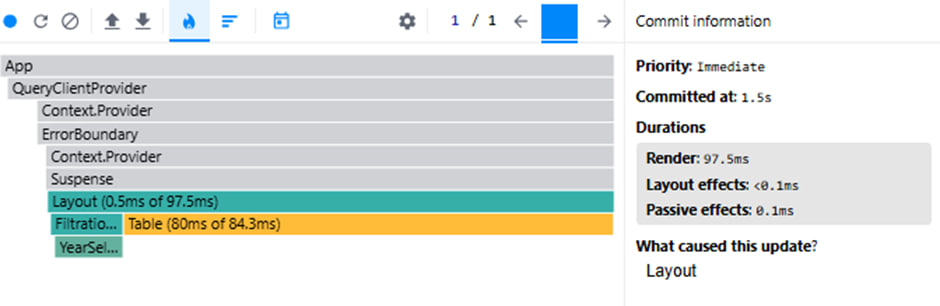  

*Ranked Chart for sorting*  
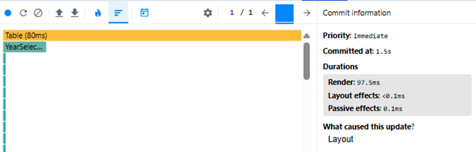  

**After Optimization**
- Commit Duration: `1.7s`
- Render Duration: `115.2ms`
- Interactions: Not recorded (Profiler did not capture interactions)  

*Flame Graph for sorting*
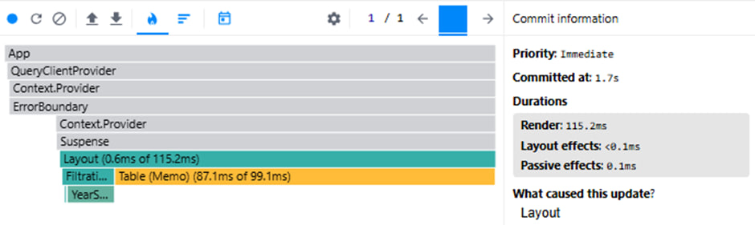

*Ranked Chart for sorting*
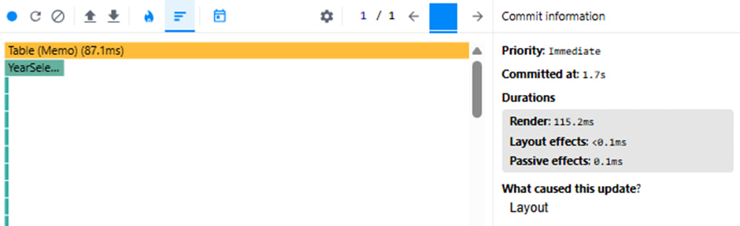

---

## 🔍 Searching for a Country

**Before Optimization**
- Commit Duration: `5.2s`
- Render Duration: `16.1ms`
- Interactions: Not recorded (Profiler did not capture interactions)  

*Flame Graph for search*
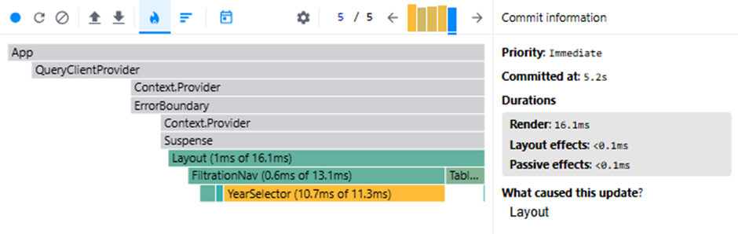

*Ranked Chart for search*
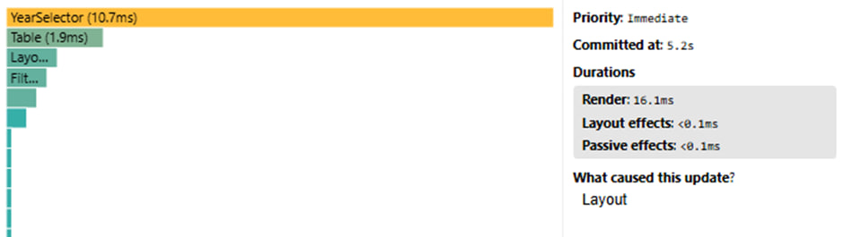

**After Optimization**
- Commit Duration: `1.5s`
- Render Duration: `28.2ms`
- Interactions: Not recorded (Profiler did not capture interactions) 

*Flame Graph for search*
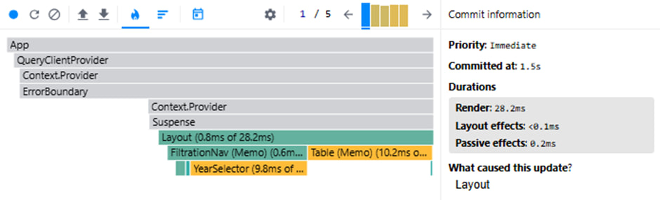

*Ranked Chart for search*
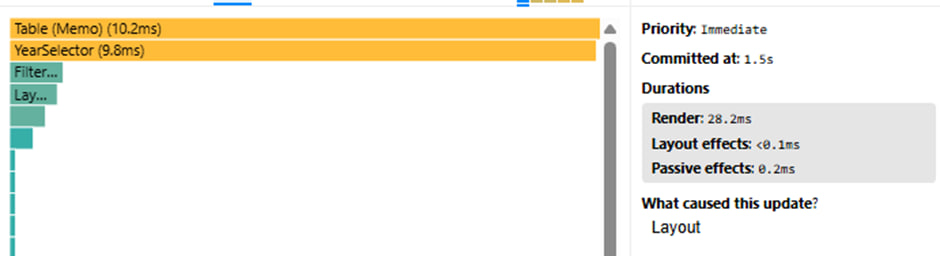

---

## 📅 Selecting a Year

**Before Optimization**
- Commit Duration: `1.7s`
- Render Duration: `91.9ms`
- Interactions: Not recorded (Profiler did not capture interactions) 

*Flame Graph for selecting year*
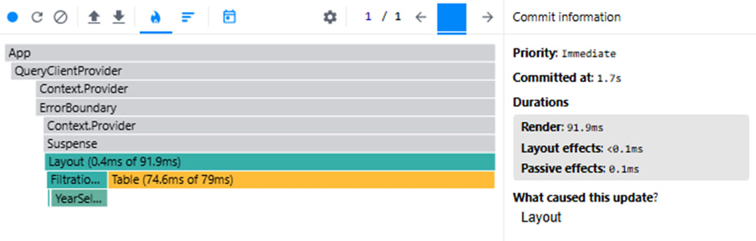

*Ranked Chart  for selecting year*
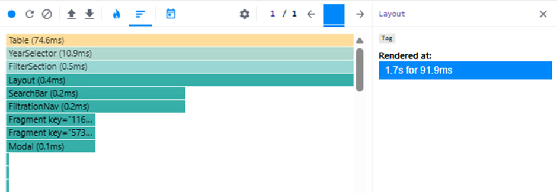

**After Optimization**
- Commit Duration: `1.6s`
- Render Duration: `121.9ms`
- Interactions: Not recorded (Profiler did not capture interactions) 

*Flame Graph for selecting year*
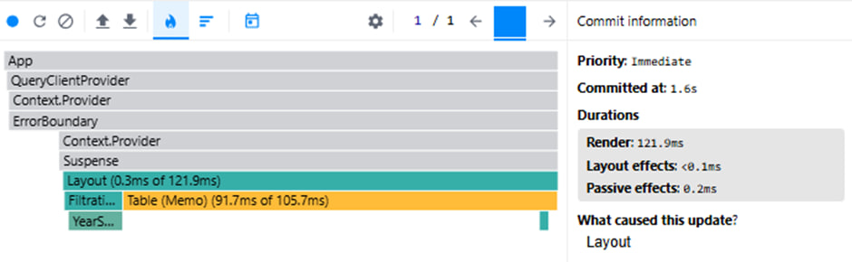

*Ranked Chart  for selecting year*
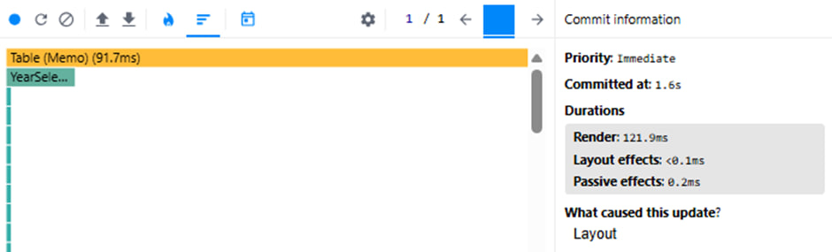

---

## ➕➖ Adding/Removing Columns

**Before Optimization**
- Commit Duration: `0.8s`
- Render Duration: `82.8ms`
- Interactions: Not recorded (Profiler did not capture interactions) 

*Flame Graph for adding/removing columns*
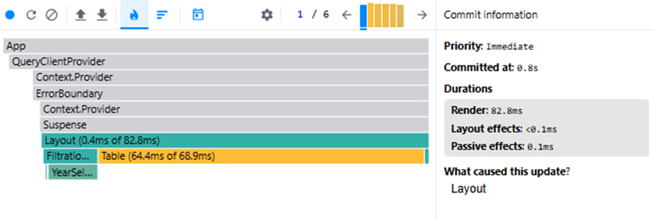

*Ranked Chart for adding/removing columns*
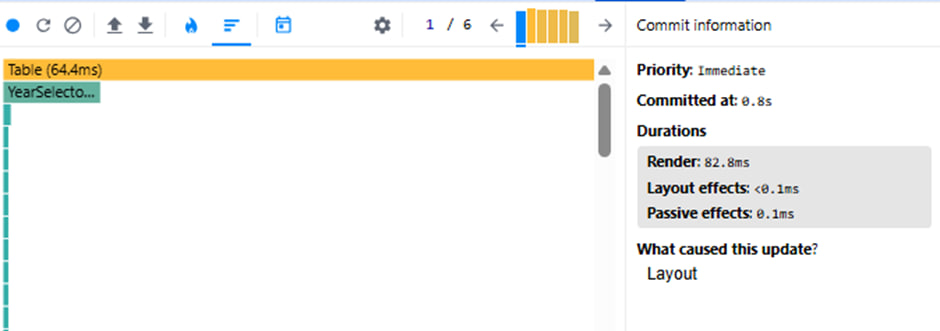

**After Optimization**
- Commit Duration: `0.8s`
- Render Duration: `113.8ms`
- Interactions: Not recorded (Profiler did not capture interactions) 

*Flame Graph for adding/removing columns*
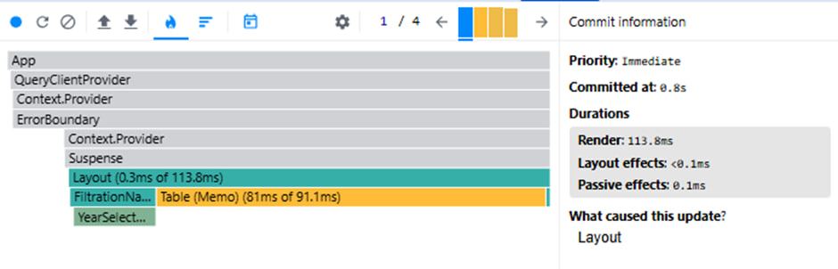

*Ranked Chart for adding/removing columns*
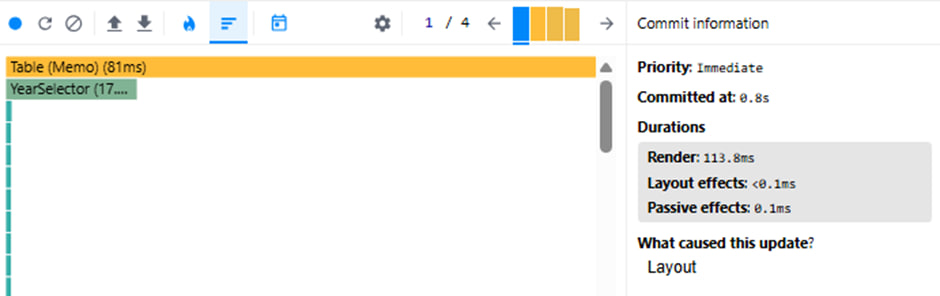

---

## ✅ Summary & Observations

- 🔧 **Search optimization** yielded the most significant improvement, reducing commit duration from `5.2s` to `1.5s`.
- 📈 **Render durations** increased slightly in some cases, but this was acceptable due to reduced overall commit time.
- ⚙️ **Year selection and column toggling** showed minor increases in render time, likely due to added logic.
- ❌ **Profiler did not capture explicit interactions**, so analysis was based on commit/render metrics only.

---

## 📌 Conclusion

The applied optimizations successfully reduced the application's load and improved responsiveness during heavier operations. Future profiling should aim to capture interactions explicitly for deeper insights and fine-tuned performance improvements.
